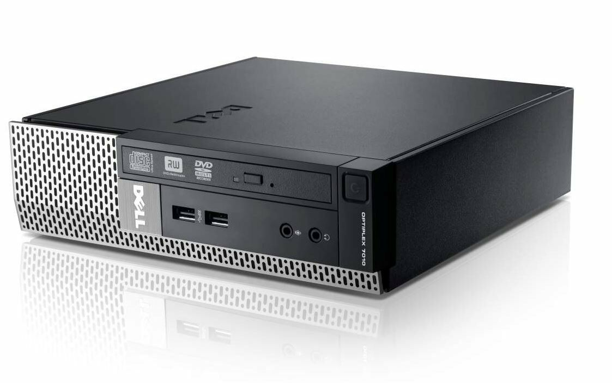

# DELL OptiPlex 3020 USFF hackintosh opencore



```
Model              DELL OptiPlex 3020 USFF
Mainboard          Intel H81 Chipset
CPU                Intel Core i3-4130
Memory             8G DDR3 1600MHz DDR3 (4GB+4GB)
Graphics           Intel HD Graphics 4400
Audio              Intel Realtek ALC3220 High Definition Audio
Ethernet           Intel I217LM
Wi-Fi              BCM943224 with converter to m-PCIE
BIOS Version       Modified
macOS Version      Catalina 10.15.7
OpenCore Version   0.6.7
```
Note : 
```
Intel HD 4400 : Please use DisplayPort (Harware Acceleration not working if connect monitor via VGA/D-SUB Port)

Serial Number : Please use your own serial number or regenerate.
```
