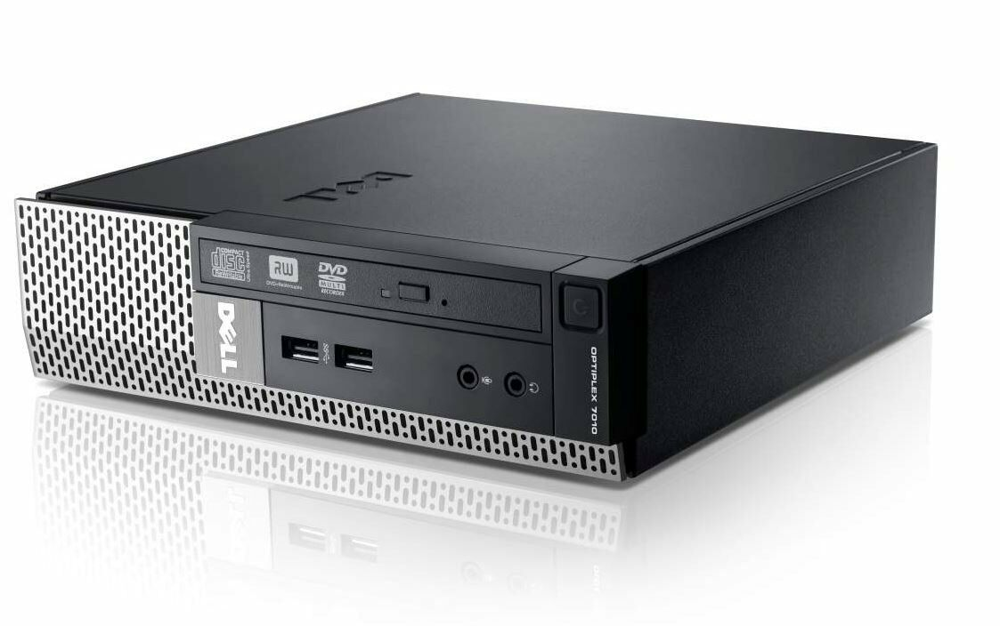
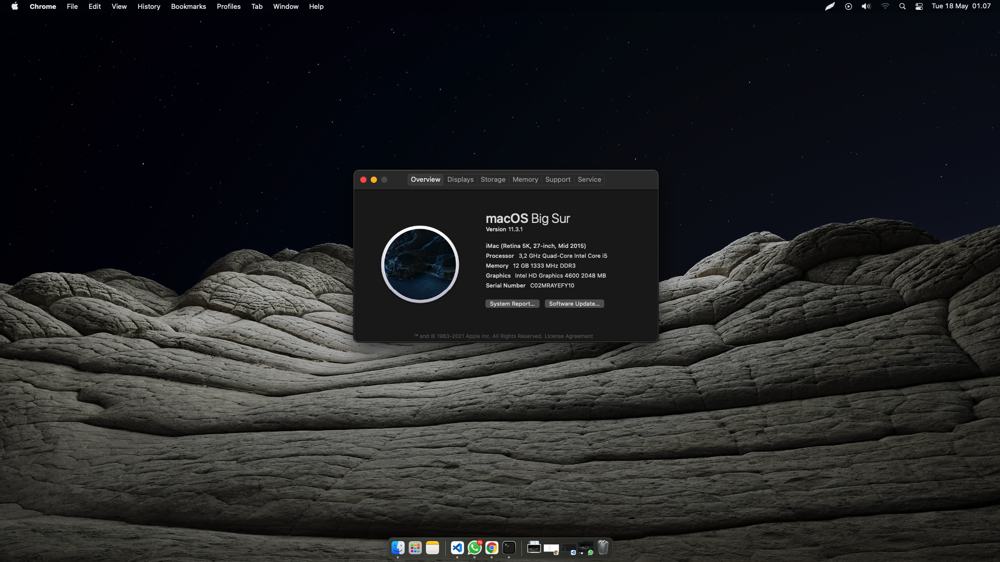
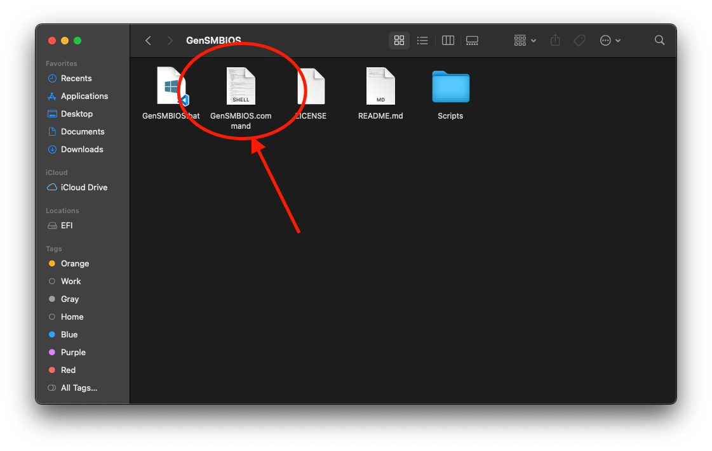
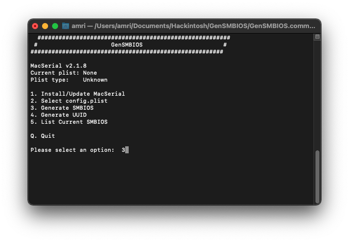
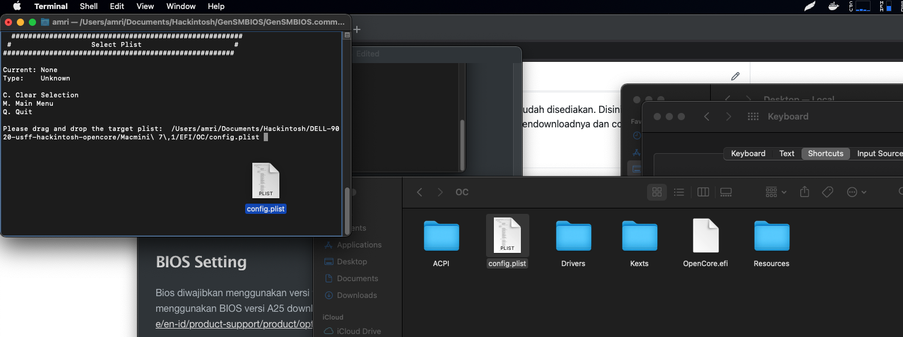
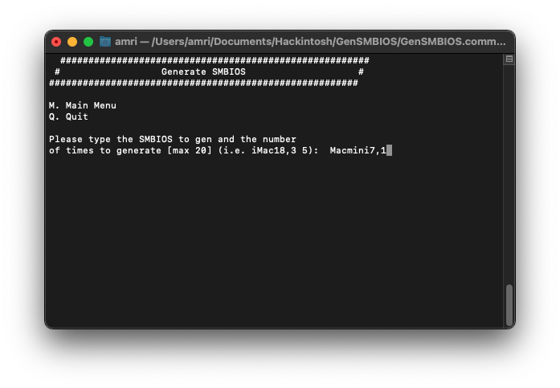
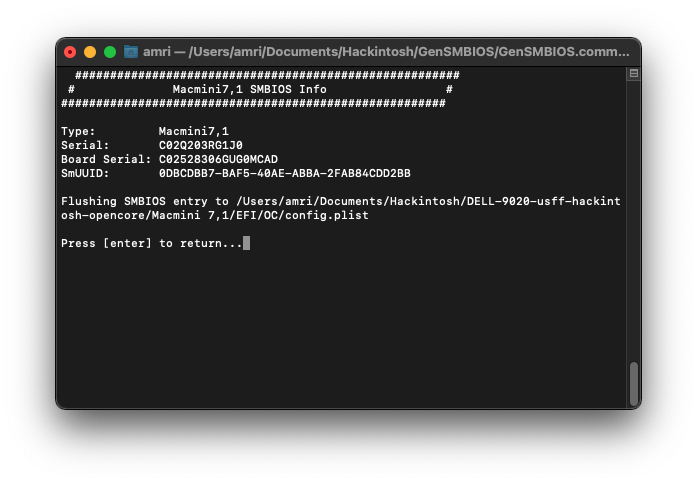
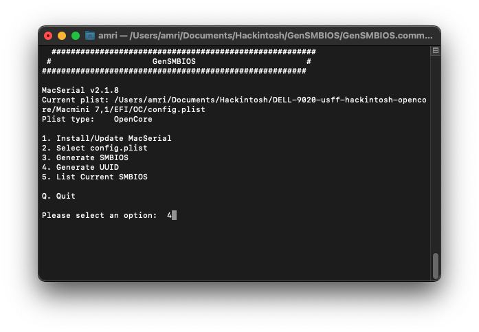
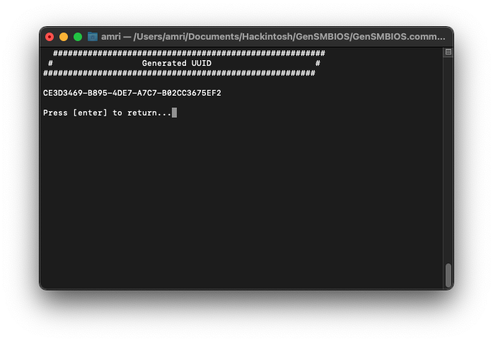

# DELL OptiPlex 9020 USFF hackintosh opencore (Support Catalina, Big Sur & Monterey)



## My Specs

```
Model              DELL OptiPlex 9020 USFF
Mainboard          Chipset Intel® Q87 Express Chipset
CPU                Intel Core i5-4460 @3.2Ghz with turbo up to 3.4Ghz
Memory             8GB DDR3 1600MHz DDR3 (8GB+4GB)
Graphics           Intel HD Graphics 4600
Audio              Intel Realtek ALC3220 High Definition Audio
Ethernet           Intel I217LM
Wi-Fi              BCM94360CS2 with converter to MINI PCI-E (Optional)
BIOS Version       A25 (Mandatory)
macOS Version      BigSur 11.17.1 -> Monterey 12.6.1
OpenCore Version   0.6.9 - 0.8.6 (updated)
```

Note :

```
Intel HD 4600 : Please use DisplayPort (Harware Acceleration not working if connect monitor via VGA/D-SUB Port)

Serial Number : Please use your own serial number or regenerate.
```

## Screenshot




## EFI

Bagi pengguna Dell Optiplex 9020 bisa menggunakan file EFI yang sudah disediakan. Disini tersedia 2 pilihan SMBIOS (iMac 15,1 dan Macmini 7,1) silahkan pilih sendiri. Dengan mendownloadnya dan copy ke flash drive.

## Edit config.plist

Didalam file EFI/OC kalian akan melihat file bernama config.plist yang berisi sebuah konfigurasi pada EFI yang telah dibuat. Namun kalian tetap harus melakukan edit file ini ya karena ada data yang unik untuk setiap pengguannya.

Apa data yang harus di edit?

```
PlatformInfo -> Generic -> MLB
PlatformInfo -> Generic -> ROM
PlatformInfo -> Generic -> SystemSerialNumber
PlatformInfo -> Generic -> SystemUUID
```

Untuk mengisi data diatas kalian bisa generate datanya menggunakan tools yang sudah disediakan yang bernama [GenSMBIOS](https://github.com/corpnewt/GenSMBIOS). Pilih `3` dan masukan SMBIOS kalian, disini saya menggunakan `iMAC15,1` seperti yang sudah tertulis pada file config.plist. Silakan sesuaikan dengan pengetahuan kalian jika ingin menggunakan SMBIOS yang berbeda.















## BIOS Setting

Bios diwajibkan menggunakan versi terbaru, untuk dell optiplex 9020 bisa menggunakan BIOS versi A25 download di https://www.dell.com/support/home/en-id/product-support/product/optiplex-9020-desktop/drivers

**General**
Boot Sequence -> Boot List Option -> UEFI
Advanced Boot Options -> check box- _Enable Legacy Option ROMs_
UEFI Boot Path Security -> Set to Never

**System Configuration**
Integrated NIC -> Enabled
Serial Port -> Disabled
Sata Operation -> AHCI

**Video**
Primary Display -> Auto (For HD4600 Nvidia or AMD)

**Secure Boot**
Secure Boot Enable -> Disabled

**Power Management**
Deep Sleep Control -> Disabled

**Virtualization Support** (**i5** and **i7** CPUs only)
VT for Direct I/O -> Disabled (see below if you need it enabled)

## Booting

- Clear NVRAM
- Pilih modGRUBShell.efi (maka akan muncul shell dimana kalian bisa ekesusi beberapa perintah di tahap berikutnya)

## Disable CFG Lock

Untuk men-disable CFG Lock pada dell optiplex 9020 kalian bisa memasukan perintah `setup_var 0xDA2 0x0`. Untuk mengembalikan sangat mudah, caranya engan mengganti 0x0 ke 0x1.

## Set DVMT pre-alloc to 64MB

Sayangnya di Dell Optiplex 9020 ini kita tidak bisa mengubah alokasi memory untuk VGA integraded intel HD pada BIOS. Tidak seperti umumnya perangkat komputer yang bisa dengan mudah menggantinya pada pengaturan BIOS.

Untuk mengatur agar alokasi memori ini menjadi 64MB caranya dengan mengetikan perintah `setup_var 0x263 0x2` dari _default_-nya yang hanya sudah diatur pada 0x1 dengan alokasi memori sebesar 32MB.

## Enable EHCI hand-off

Silakan ikuti saja perintah dibawah ini utuk berikutnya.

`Sebelumnya pastikan BIOS sudah menggunakan versi terbaru jika tidak port usb akan tidak berfungsi.`

`setup_var 0x2 0x1` = Enable EHCI hand-off

`setup_var 0x144 0x1` = XHCI enable mode

`setup_var 0x15A 0x2` = Route EHCx ports to XHCI

`setup_var 0x146 0x0` = Disable EHCx ports

`setup_var 0x147 0x0` = Disable EHCX ports

## Installing

Untuk lanjut ke tahap instalasi bisa langsung kunjungi https://dortania.github.io/OpenCore-Install-Guide/
